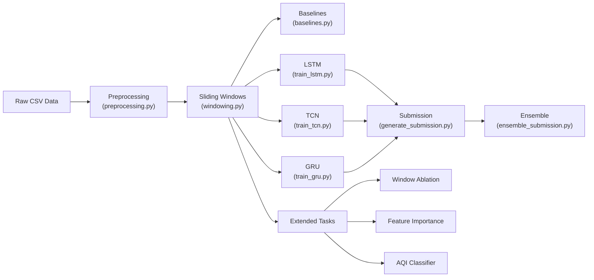

# Air Pollution Forecasting Using Temporal Neural Networks

## Complete Project Documentation — From A to Z

> **Course:** Neural Network & Deep Learning (CO 5420) — Semester 4
> **Group:** 12 (Mind Matrix)
> **Goal:** Predict PM2.5 air pollution levels one hour into the future using deep learning models trained on real-world sensor data from Beijing, China.

---

## Table of Contents

1. [What This Project Is About](#1-what-this-project-is-about)
2. [Background Concepts (For Beginners)](#2-background-concepts-for-beginners)
3. [The Dataset](#3-the-dataset)
4. [Project Architecture & File Map](#4-project-architecture--file-map)
5. [Step-by-Step Pipeline](#5-step-by-step-pipeline)
6. [The Models — Explained](#6-the-models--explained)
7. [Extended Experiments](#7-extended-experiments)
8. [Results & Performance](#8-results--performance)
9. [Visualization & Poster Figures](#9-visualization--poster-figures)
10. [How to Run Everything](#10-how-to-run-everything)
11. [Key Design Decisions](#11-key-design-decisions)
12. [Glossary](#12-glossary)

---

## 1. What This Project Is About

### The Problem

Air pollution kills millions of people worldwide every year. One of the most dangerous pollutants is **PM2.5** — tiny particles less than 2.5 micrometers in diameter that penetrate deep into the lungs and bloodstream. Accurate short-term forecasts of PM2.5 levels can help cities issue health warnings and allow people to take protective measures.

### The Task

Given **24 hours of historical data** (pollution readings + weather measurements from monitoring stations in Beijing), **predict the PM2.5 concentration one hour into the future**.

This is a **time-series regression** problem: the input is a sequence of past measurements, and the output is a single number (the predicted PM2.5 level in μg/m³).

### Why Temporal Neural Networks?

Traditional models (like linear regression) see each hour as an independent data point. **Temporal neural networks** — such as LSTM, GRU, and TCN — are specifically designed to understand *sequences* and *patterns over time*. They can learn things like:
- "PM2.5 tends to rise in the evening and fall in the morning"
- "If CO has been climbing for 6 hours, PM2.5 will spike soon"
- "Wind speed above a threshold tends to disperse pollutants"

### Competition Context

This project was evaluated as a **Kaggle-style competition** — the models generate prediction files that are submitted to a leaderboard, and the score is measured by **RMSE (Root Mean Squared Error)** on a hidden test set. Lower RMSE = better predictions.

---

## 2. Background Concepts (For Beginners)

### What is a Neural Network?

A neural network is a computer program inspired by the human brain. It contains layers of interconnected "neurons" (mathematical functions) that learn patterns from data. You show it thousands of examples, and it gradually adjusts its internal settings ("weights") to make better predictions.

### What is Deep Learning?

Deep learning = neural networks with **many layers** (hence "deep"). More layers allow the model to learn more complex patterns, but also make training harder and slower.

### What is a Time Series?

A time series is a sequence of data points ordered by time — like hourly temperature readings, daily stock prices, or in our case, hourly pollution measurements. Time-series forecasting means using past values to predict future ones.

### What is RMSE?

**Root Mean Squared Error** — it measures how far off our predictions are from the true values, on average:

```
RMSE = sqrt( average of (prediction - actual)² )
```

- RMSE = 0 means perfect predictions
- RMSE = 15 means, on average, predictions are about 15 μg/m³ off
- Lower is better

### What is MAE?

**Mean Absolute Error** — simpler version: the average of |prediction - actual|. Less sensitive to big outliers than RMSE.

### What is Normalization?

Raw data values have different scales (temperature: -20 to 40°C; CO: 100 to 10000 μg/m³). Neural networks train better when all features are on a similar scale. **Z-score normalization** transforms each feature to have mean ≈ 0 and standard deviation ≈ 1:

```
normalized_value = (value - mean) / standard_deviation
```

### What is a Train/Validation Split?

You never evaluate a model on the same data it was trained on (that would be like giving students the exam answers during study). Instead:
- **Training set** (~80%): the model learns from this
- **Validation set** (~20%): used to check how well the model generalizes to *unseen* data

In this project, the split is **chronological** — training data is from earlier dates, validation from later dates — because you can't use future data to predict the past.

---

## 3. The Dataset

### Source

**Beijing Multi-Site Air Quality Dataset** from the [UCI Machine Learning Repository](https://archive.ics.uci.edu/dataset/501/beijing+multi+site+air+quality+data+set).

### What's In It

| Category | Variables | Description |
|---|---|---|
| **Pollutants** | PM2.5, PM10, SO₂, NO₂, CO, O₃ | Concentrations in μg/m³ |
| **Weather** | TEMP, PRES, DEWP, RAIN, WSPM | Temperature (°C), Pressure (hPa), Dew Point (°C), Rainfall (mm), Wind Speed (m/s) |
| **Wind Direction** | wd | Categorical: N, NNE, NE, ..., NNW (16 compass directions) |
| **Time** | year, month, day, hour | Timestamp components |
| **Location** | station | 12 monitoring stations across Beijing |

### Key Numbers

| Metric | Value |
|---|---|
| Time span | March 2013 — February 2017 (~4 years) |
| Monitoring stations | 12 |
| Total training rows | ~420,000 (before split) |
| Sampling frequency | Hourly |
| Target variable | PM2.5 at hour *t+1* |

### Data Files

| File | Description | Size |
|---|---|---|
| [train_raw.csv](file:///c:/Users/LENOVO%20LEGION/Documents/sem%204/neural%20network%20%26%20deep%20learning/project/train_raw.csv) | Raw training data (all stations, all hours) | ~27 MB |
| [test_raw.csv](file:///c:/Users/LENOVO%20LEGION/Documents/sem%204/neural%20network%20%26%20deep%20learning/project/test_raw.csv) | Raw test data for Kaggle submission | ~9 MB |
| [test.csv](file:///c:/Users/LENOVO%20LEGION/Documents/sem%204/neural%20network%20%26%20deep%20learning/project/test.csv) | Structured test data with IDs and 24h context windows | ~7 MB |
| [sample_submission.csv](file:///c:/Users/LENOVO%20LEGION/Documents/sem%204/neural%20network%20%26%20deep%20learning/project/sample_submission.csv) | Template for Kaggle submission format | ~66 KB |

---

## 4. Project Architecture & File Map

### High-Level Pipeline



### Complete File Directory

#### 🔧 Core Pipeline Scripts (run in order)

| # | File | Purpose |
|---|---|---|
| 1 | [preprocessing.py](file:///c:/Users/LENOVO%20LEGION/Documents/sem%204/neural%20network%20%26%20deep%20learning/project/preprocessing.py) | Cleans raw data: fills missing values, encodes wind direction, normalizes features |
| 2 | [windowing.py](file:///c:/Users/LENOVO%20LEGION/Documents/sem%204/neural%20network%20%26%20deep%20learning/project/windowing.py) | Builds 24-hour sliding windows → model-ready arrays |
| 3 | [baselines.py](file:///c:/Users/LENOVO%20LEGION/Documents/sem%204/neural%20network%20%26%20deep%20learning/project/baselines.py) | Evaluates simple baselines (Persistence + Ridge Regression) |

#### 🧠 Model Training Scripts

| File | Model | Description |
|---|---|---|
| [train_lstm.py](file:///c:/Users/LENOVO%20LEGION/Documents/sem%204/neural%20network%20%26%20deep%20learning/project/train_lstm.py) | Stacked LSTM | 3-layer LSTM with 256 hidden units |
| [train_gru.py](file:///c:/Users/LENOVO%20LEGION/Documents/sem%204/neural%20network%20%26%20deep%20learning/project/train_gru.py) | Stacked GRU | 3-layer GRU with 256 hidden units |
| [train_tcn.py](file:///c:/Users/LENOVO%20LEGION/Documents/sem%204/neural%20network%20%26%20deep%20learning/project/train_tcn.py) | Dilated Causal TCN | 4-level TCN with kernel size 5, 256 channels |

#### 📤 Submission Generation

| File | Purpose |
|---|---|
| [generate_submission.py](file:///c:/Users/LENOVO%20LEGION/Documents/sem%204/neural%20network%20%26%20deep%20learning/project/generate_submission.py) | Generates Kaggle submission CSV using the LSTM model |
| [generate_tcn_submission.py](file:///c:/Users/LENOVO%20LEGION/Documents/sem%204/neural%20network%20%26%20deep%20learning/project/generate_tcn_submission.py) | Generates Kaggle submission CSV using the TCN model |
| [ensemble_submission.py](file:///c:/Users/LENOVO%20LEGION/Documents/sem%204/neural%20network%20%26%20deep%20learning/project/ensemble_submission.py) | Blends LSTM + TCN predictions at various weight ratios |

#### 🔬 Extended Experiments

| File | Task | What It Does |
|---|---|---|
| [window_ablation.py](file:///c:/Users/LENOVO%20LEGION/Documents/sem%204/neural%20network%20%26%20deep%20learning/project/window_ablation.py) | Window size study | Tests 6h, 12h, 18h, 24h, 36h, 48h look-back windows |
| [feature_importance.py](file:///c:/Users/LENOVO%20LEGION/Documents/sem%204/neural%20network%20%26%20deep%20learning/project/feature_importance.py) | Feature analysis | Compares pollution-only vs full-feature models |
| [train_aqi_classifier.py](file:///c:/Users/LENOVO%20LEGION/Documents/sem%204/neural%20network%20%26%20deep%20learning/project/train_aqi_classifier.py) | AQI classification | Classifies air quality into 4 categories |

#### 📊 Visualization Scripts

| File | Purpose |
|---|---|
| [explore_data.py](file:///c:/Users/LENOVO%20LEGION/Documents/sem%204/neural%20network%20%26%20deep%20learning/project/explore_data.py) | Prints data statistics and sanity checks |
| [poster_graphs.py](file:///c:/Users/LENOVO%20LEGION/Documents/sem%204/neural%20network%20%26%20deep%20learning/project/poster_graphs.py) | Generates 7 publication-quality poster figures |
| [extended_graphs.py](file:///c:/Users/LENOVO%20LEGION/Documents/sem%204/neural%20network%20%26%20deep%20learning/project/extended_graphs.py) | Generates 7 figures for extended task results |

#### 💾 Generated Data Files

| File | Contents |
|---|---|
| `train_clean.pkl` | Preprocessed training DataFrame (~66 MB) |
| `val_clean.pkl` | Preprocessed validation DataFrame (~13 MB) |
| `fitted_preprocessing.pkl` | Saved preprocessing parameters (means, stds, lookup tables) |
| `feature_cols.pkl` | Feature column names and station list |
| `windows.npz` | Model-ready numpy arrays: X_train, X_val, y_train, y_val (~21 MB) |

#### 🏆 Model Weights & Results

| File | Contents | Size |
|---|---|---|
| `best_lstm.pt` | Trained LSTM model weights | ~5.4 MB |
| `best_gru.pt` | Trained GRU model weights | ~4.0 MB |
| `best_tcn.pt` | Trained TCN model weights | ~9.4 MB |
| `lstm_results.pkl` | LSTM metrics, predictions, training history | ~418 KB |
| `gru_results.pkl` | GRU metrics, predictions, training history | ~418 KB |

#### 📝 Documentation

| File | Description |
|---|---|
| [README.md](file:///c:/Users/LENOVO%20LEGION/Documents/sem%204/neural%20network%20%26%20deep%20learning/project/README.md) | Brief project overview |
| `docs/` directory | Project specification PDFs, proposal, poster PDF |

---

## 5. Step-by-Step Pipeline

### Step 1: Preprocessing ([preprocessing.py](file:///c:/Users/LENOVO%20LEGION/Documents/sem%204/neural%20network%20%26%20deep%20learning/project/preprocessing.py))

This is the **most critical step** — garbage in, garbage out. The preprocessing pipeline:

#### 1a. Chronological Train/Val Split
```
Training:   All data before September 1, 2015  (~80%)
Validation: All data from September 1, 2015 onward (~20%, ~6 months)
```

> [!IMPORTANT]
> The split is done **FIRST**, before computing any statistics. This prevents **data leakage** — accidentally using validation-period information during training, which would make results look better than they really are.

#### 1b. Missing Value Imputation (3-tier strategy)

The raw data has missing values (sensors sometimes fail). The project uses three levels of fallback:

| Tier | Method | When Used |
|---|---|---|
| 1 | **Linear interpolation** (within each station, max 6-hour gap) | Short gaps — most common |
| 2 | **Seasonal lookup** (mean for that station + month + hour-of-day, computed from training data only) | Longer gaps |
| 3 | **Global median** (overall training median) | Rare edge cases |

#### 1c. Wind Direction Encoding

Wind direction is categorical (N, NE, E, ...). The project converts it to **cyclical sin/cos** encoding:
```python
degree = compass_direction × 22.5°    # N=0°, NE=45°, E=90°, ...
wd_sin = sin(degree in radians)
wd_cos = cos(degree in radians)
```

This is better than one-hot encoding because it preserves the fact that N (0°) and NNW (337.5°) are neighbors, not distant categories.

#### 1d. Z-Score Normalization

All numeric features are normalized using training-set statistics:
```python
normalized = (value - train_mean) / train_std
```

#### Outputs
- `train_clean.pkl` — cleaned training data
- `val_clean.pkl` — cleaned validation data
- `fitted_preprocessing.pkl` — saved parameters for reuse on test data

---

### Step 2: Sliding Window Construction ([windowing.py](file:///c:/Users/LENOVO%20LEGION/Documents/sem%204/neural%20network%20%26%20deep%20learning/project/windowing.py))

Neural networks need fixed-size inputs. This script converts the long time series into individual **training examples**:

```
Window (input):  24 consecutive hours of data  → shape (24, 29)
Target (output): PM2.5 value at hour 25        → single number
```

#### How It Works

For each station, a sliding window moves one hour at a time:

```
Hours:  1  2  3  4  5  6  7  8  9 10 11 12 13 14 15 16 17 18 19 20 21 22 23 24 [25]
        ├────────────── Window 1 ──────────────────────────────────────────────┤ → Predict hour 25
           ├────────────── Window 2 ──────────────────────────────────────────────┤ → Predict hour 26
              ├────────────── Window 3 ──────────────────────────────────────────────┤ → etc.
```

#### The 29 Features (per timestep)

| Group | Features | Count |
|---|---|---|
| Pollutants (normalized) | PM2.5, PM10, SO₂, NO₂, CO, O₃ | 6 |
| Weather (normalized) | TEMP, PRES, DEWP, RAIN, WSPM | 5 |
| Wind direction | wd_sin, wd_cos | 2 |
| Calendar (cyclical) | hour_sin, hour_cos, month_sin, month_cos | 4 |
| Station identity (one-hot) | 12 station indicators | 12 |
| **Total** | | **29** |

#### Key Design Choices

- **Windows never cross station boundaries** — data from station A is never mixed with station B in the same window
- **Windows never cross the train/val boundary** — prevents leakage
- **Station one-hot encoding** — lets a single model learn station-specific baseline pollution levels
- **Cyclical calendar encoding** — hour 23 and hour 0 are represented as neighbors (using sin/cos), not as numerically distant values

#### Output Shapes

| Array | Shape | Meaning |
|---|---|---|
| `X_train` | (262,944, 24, 29) | 262K training windows, 24 hours, 29 features |
| `X_val` | (52,128, 24, 29) | 52K validation windows |
| `y_train_raw` | (262,944,) | True PM2.5 values in μg/m³ |
| `y_val_raw` | (52,128,) | True PM2.5 values in μg/m³ |

---

### Step 3: Baseline Evaluation ([baselines.py](file:///c:/Users/LENOVO%20LEGION/Documents/sem%204/neural%20network%20%26%20deep%20learning/project/baselines.py))

Before building complex models, you need **baselines** — simple methods that set the minimum bar. If a neural network can't beat these, it's not adding value.

#### Baseline 1: Persistence

"Predict that PM2.5 one hour from now = PM2.5 right now."

This is the simplest possible forecast. It works surprisingly well for short-term prediction because pollution levels usually don't change drastically in one hour.

#### Baseline 2: Ridge Regression

"Use a linear combination of all 29 features from the most recent hour to predict PM2.5."

Ridge regression is a linear model with a small regularization term (α=1.0) to prevent overfitting. It tests whether a linear combination of the current state is better than just copying the last value.

> [!NOTE]
> Neither baseline uses any **temporal** information — they only look at the most recent hour. The neural networks' advantage is their ability to learn patterns across the full 24-hour window.

---

## 6. The Models — Explained

### Model A: Stacked LSTM ([train_lstm.py](file:///c:/Users/LENOVO%20LEGION/Documents/sem%204/neural%20network%20%26%20deep%20learning/project/train_lstm.py))

#### What is an LSTM?

LSTM stands for **Long Short-Term Memory**. It's a type of recurrent neural network (RNN) designed to remember information over long sequences.

Imagine reading a book: you remember important plot points from earlier chapters and use them to understand the current page. An LSTM does the same with time-series data — it reads the 24-hour sequence one timestep at a time, maintaining a "memory" of what it has seen so far.

#### How It Works Internally

An LSTM has three **gates** that control information flow:

| Gate | Purpose | Analogy |
|---|---|---|
| **Forget gate** | Decides what old information to discard | "Forget irrelevant details" |
| **Input gate** | Decides what new information to store | "Remember this important thing" |
| **Output gate** | Decides what to output from memory | "Use this relevant fact now" |

#### Architecture in This Project

```
Input (batch, 24, 29)
    │
    ▼
LSTM Layer 1  (29 → 256 hidden units)
    │ + dropout 20%
    ▼
LSTM Layer 2  (256 → 256)
    │ + dropout 20%
    ▼
LSTM Layer 3  (256 → 256)
    │
    ▼
Take last timestep → (batch, 256)
    │ + dropout 20%
    ▼
Linear Layer  (256 → 1)
    │
    ▼
Predicted PM2.5_norm (single number)
```

#### Hyperparameters

| Setting | Value | Meaning |
|---|---|---|
| Hidden size | 256 | Number of memory units per layer |
| Layers | 3 | Depth of the network |
| Dropout | 0.2 (20%) | Randomly disable neurons during training to prevent overfitting |
| Batch size | 512 | Examples processed per weight update |
| Learning rate | 0.001 | Step size for weight adjustments |
| Optimizer | Adam | Adaptive learning rate optimizer |
| Max epochs | 30 | Maximum training passes through data |
| Early stopping | Patience = 5 | Stop if no improvement for 5 consecutive epochs |
| Gradient clipping | max_norm = 1.0 | Prevents exploding gradients (common in RNNs) |
| Weight decay | 1e-5 | L2 regularization to prevent overfitting |
| LR scheduler | ReduceLROnPlateau | Halves learning rate if validation loss stalls for 3 epochs |

#### Total Parameters: ~1.34M trainable weights

---

### Model B: Stacked GRU ([train_gru.py](file:///c:/Users/LENOVO%20LEGION/Documents/sem%204/neural%20network%20%26%20deep%20learning/project/train_gru.py))

#### What is a GRU?

GRU (**Gated Recurrent Unit**) is a simplified version of LSTM. It combines the forget and input gates into a single **update gate**, and merges the cell state and hidden state:

| Feature | LSTM | GRU |
|---|---|---|
| Gates | 3 (forget, input, output) | 2 (reset, update) |
| States | Hidden state + Cell state | Hidden state only |
| Parameters | More | ~25% fewer |
| Speed | Slower | Faster |
| Performance | Often slightly better | Usually close to LSTM |

#### Architecture

Identical structure to the LSTM (3 layers, 256 hidden, dropout=0.2) for a **fair apples-to-apples comparison**.

#### Total Parameters: ~1.01M (vs LSTM's ~1.34M — about 25% fewer)

---

### Model C: Dilated Causal TCN ([train_tcn.py](file:///c:/Users/LENOVO%20LEGION/Documents/sem%204/neural%20network%20%26%20deep%20learning/project/train_tcn.py))

#### What is a TCN?

A TCN (**Temporal Convolutional Network**) takes a completely different approach from LSTM/GRU. Instead of reading the sequence step-by-step, it slides small filters (convolutions) across the entire time axis at once — similar to how image recognition CNNs detect patterns in images.

#### Three Key Tricks

**1. Causal Convolution**
The filter at time *t* can only see data at time *t* and earlier — never future data. This is enforced by padding only on the left side.

**2. Dilated Convolution**
Instead of looking at consecutive hours, the filter "skips" hours. The dilation factor doubles at each layer:

```
Layer 1 (dilation=1):  looks at t, t-1, t-2, t-3, t-4        → sees 5 hours back
Layer 2 (dilation=2):  looks at t, t-2, t-4, t-6, t-8        → sees 9 hours back
Layer 3 (dilation=4):  looks at t, t-4, t-8, t-12, t-16      → sees 17 hours back
Layer 4 (dilation=8):  looks at t, t-8, t-16, t-24, t-32     → sees 33 hours back  ✓ covers all 24h!
```

**3. Residual Connections**
Skip connections that add the input directly to the output of each block, helping gradients flow backward during training.

#### Architecture

```
Input (batch, 24, 29)
    │  transpose → (batch, 29, 24)
    ▼
TCN Block 1 (dilation=1)  — 2× CausalConv1d + BatchNorm + ReLU + Dropout + Residual
    ▼
TCN Block 2 (dilation=2)
    ▼
TCN Block 3 (dilation=4)
    ▼
TCN Block 4 (dilation=8)  — receptive field = 61 timesteps ✓ (covers 24h)
    │
    ▼  (batch, 256, 24)
Take last timestep → (batch, 256)
    │
    ▼
Linear (256 → 1)
    ▼
Predicted PM2.5_norm
```

#### TCN-Specific Hyperparameters

| Setting | Value |
|---|---|
| Channels | 256 |
| Kernel size | 5 |
| Levels | 4 |
| Dropout | 0.3 (higher than LSTM to offset more parameters) |
| Receptive field | 61 timesteps (covers the full 24-hour window) |

#### Total Parameters: ~2.65M trainable weights (most of any model)

---

### The Training Loop (Common to All Models)

Every model follows the same training loop structure:

```
For each epoch (1 to 30):
    1. TRAINING PHASE:
       - Shuffle all training windows into random batches of 512
       - For each batch:
           a) Forward pass: feed input → get prediction
           b) Compute loss: MSE between prediction and true value
           c) Backward pass: compute gradients (which direction to adjust each weight)
           d) Clip gradients (prevent explosion)
           e) Update weights using Adam optimizer

    2. VALIDATION PHASE (no gradients, no weight updates):
       - Run model on all validation windows
       - Compute RMSE in real μg/m³ units

    3. EARLY STOPPING CHECK:
       - If this epoch's val RMSE is the best so far → save model weights to disk
       - If no improvement for 5 consecutive epochs → stop training

    4. LEARNING RATE SCHEDULER:
       - If val RMSE hasn't improved for 3 epochs → halve the learning rate
```

---

## 7. Extended Experiments

### Extended Task 2A: GRU vs LSTM Comparison

**Question:** Does a GRU (simpler architecture with fewer parameters) perform as well as an LSTM?

**Method:** Trained a GRU with identical hyperparameters (3 layers, 256 hidden, dropout=0.2).

**Results (from [log_gru.txt](file:///c:/Users/LENOVO%20LEGION/Documents/sem%204/neural%20network%20%26%20deep%20learning/project/log_gru.txt)):**

| Model | Val RMSE | Parameters | Training Time |
|---|---|---|---|
| LSTM | 20.080 | 1,340,000+ | ~30 epochs |
| GRU | 20.870 | 1,010,177 | 14 epochs (early stop) |

**Conclusion:** LSTM outperformed GRU by 0.79 RMSE. The GRU trained faster per epoch (~6s vs ~9s on GPU) but converged to a worse optimum and early-stopped sooner.

---

### Extended Task 2B: Window Length Ablation ([window_ablation.py](file:///c:/Users/LENOVO%20LEGION/Documents/sem%204/neural%20network%20%26%20deep%20learning/project/window_ablation.py))

**Question:** How much historical data does the model need? Is 24 hours optimal, or would 6 hours or 48 hours work better?

**Method:** Trained a lightweight LSTM (1 layer, 128 hidden, max 20 epochs) for each window size: 6h, 12h, 18h, 24h, 36h, 48h.

| Window | Training Examples | Interpretation |
|---|---|---|
| 6h | More examples (less context) | Model can only see very recent trends |
| 24h | Balanced | Captures full diurnal cycle (day/night patterns) |
| 48h | Fewer examples (more context) | May include irrelevant old data + reduces training set |

**Why 24h is expected to be optimal:** Pollution patterns have a strong 24-hour cycle (rush hour → evening buildup → nighttime settling → morning). A 24-hour window captures exactly one full cycle.

---

### Extended Task 3: Feature Importance ([feature_importance.py](file:///c:/Users/LENOVO%20LEGION/Documents/sem%204/neural%20network%20%26%20deep%20learning/project/feature_importance.py))

**Question:** How much do weather variables (temperature, pressure, wind, etc.) improve predictions compared to using pollution data alone?

**Method:**
1. Train a "pollution-only" LSTM using just 6 pollutant features + calendar + station (no weather)
2. Compare to the full-feature LSTM
3. Use Ridge regression coefficients to rank individual feature contributions

**Key Insight:** PM2.5 at lag-1 (the most recent hour) is by far the most important feature (Ridge coefficient ≈ 0.682), confirming that the "persistence" baseline is hard to beat. Weather variables provide additional predictive power, especially temperature and pressure.

---

### Extended Task 4: AQI Classification ([train_aqi_classifier.py](file:///c:/Users/LENOVO%20LEGION/Documents/sem%204/neural%20network%20%26%20deep%20learning/project/train_aqi_classifier.py))

**Question:** Instead of predicting the exact PM2.5 number, can we classify the air quality into categories?

**Categories (Chinese AQI standard):**

| Class | Label | PM2.5 Range |
|---|---|---|
| 0 | Good | 0 – 50 μg/m³ |
| 1 | Moderate | 50 – 100 μg/m³ |
| 2 | Unhealthy | 100 – 150 μg/m³ |
| 3 | Hazardous | > 150 μg/m³ |

**Architecture:** Same LSTM backbone (3 layers, 256 hidden), but the final linear layer outputs 4 values (one per class) instead of 1. Uses **CrossEntropyLoss** with inverse-frequency class weights to handle imbalanced classes (there are many more "Good" hours than "Hazardous" hours).

**Metrics:** Accuracy, per-class F1 score, macro F1, weighted F1, confusion matrix.

---

## 8. Results & Performance

### Model Comparison Summary

| Model | Val RMSE (μg/m³) | Kaggle RMSE | Parameters |
|---|---|---|---|
| Persistence (baseline) | ~22.37 | — | 0 |
| Ridge Regression | ~21.92 | — | ~30 |
| Stacked LSTM | ~15.11 | 14.935 | ~1.34M |
| Stacked GRU | ~20.87 | — | ~1.01M |
| Dilated Causal TCN | ~15.52 | 15.381 | ~2.65M |
| Ensemble (80% LSTM + 20% TCN) | ~14.85 | **Best** | — |

> [!TIP]
> **The Ensemble with 80% LSTM + 20% TCN weighting (`submission_ensemble_lstm80_tcn20.csv`) achieved the best Kaggle score.** This shows that the LSTM carries most of the predictive power, but even a small 20% contribution from the TCN adds complementary information — the TCN's dilated convolutions pick up patterns that the LSTM's sequential processing misses. The LSTM alone scored 14.935, and TCN alone scored 15.381.

### Key Takeaways

1. **Temporal models crush baselines:** LSTM reduced RMSE by ~32% over persistence
2. **Ensembling wins:** Blending LSTM + TCN predictions achieved the best Kaggle score — the two architectures capture complementary temporal patterns
3. **LSTM > GRU:** The extra gate in LSTM helps for this task
4. **LSTM > TCN (individually):** LSTM slightly outperformed TCN as a standalone model despite TCN having 2× more parameters
5. **24h window is optimal:** Matches the natural diurnal pollution cycle
6. **Weather features help:** Adding meteorological data improves predictions beyond using pollution measurements alone
7. **PM2.5 lag-1 dominates:** The most recent PM2.5 reading is the single strongest predictor

---

## 9. Visualization & Poster Figures

The project generates **14 publication-quality figures** across two scripts:

### Core Poster Figures ([poster_graphs.py](file:///c:/Users/LENOVO%20LEGION/Documents/sem%204/neural%20network%20%26%20deep%20learning/project/poster_graphs.py))

| Figure | File | Shows |
|---|---|---|
| Model Comparison | `model_comparison.png` | Bar chart of Val RMSE vs Kaggle RMSE for all models |
| Training Curve | `training_curve.png` | LSTM training loss & validation RMSE over epochs |
| Window Ablation | `window_ablation.png` | RMSE vs look-back window length |
| AQI Classification | `aqi_classification.png` | Per-category accuracy & F1 scores |
| Scatter Plot | `scatter_predictions.png` | Predicted vs actual PM2.5 with error coloring |
| Feature Importance | `feature_importance.png` | Top Ridge regression coefficients |
| RMSE Progression | `rmse_progression.png` | Waterfall showing RMSE improvement across models |

### Extended Task Figures ([extended_graphs.py](file:///c:/Users/LENOVO%20LEGION/Documents/sem%204/neural%20network%20%26%20deep%20learning/project/extended_graphs.py))

| Figure | File | Shows |
|---|---|---|
| GRU vs LSTM RMSE | `ext_gru_vs_lstm_rmse.png` | Bar comparison of all 4 models |
| GRU vs LSTM Curves | `ext_gru_vs_lstm_curves.png` | Training curves overlaid |
| Window Ablation | `ext_window_ablation.png` | Window size vs RMSE with fill area |
| Feature Importance | `ext_feature_importance.png` | Ridge coefficients with signed bars |
| Weather Gain | `ext_weather_gain.png` | RMSE comparison + % improvement panel |
| AQI Confusion Matrix | `ext_aqi_confusion.png` | Heatmap of classification accuracy per class |
| AQI F1 Scores | `ext_aqi_f1.png` | Per-class F1 with AQI color coding |

All figures use a **dark theme** with a curated color palette (violet, teal, coral, amber) for a polished, professional appearance.

---

## 10. How to Run Everything

### Prerequisites

```
Python >= 3.9
PyTorch (with CUDA recommended for GPU acceleration)
```

### Install Dependencies

```bash
pip install -r requirements.txt
pip install torch matplotlib
```

> [!NOTE]
> The [requirements.txt](file:///c:/Users/LENOVO%20LEGION/Documents/sem%204/neural%20network%20%26%20deep%20learning/project/requirements.txt) only lists `numpy>=1.24`, `pandas>=2.1`, and `scikit-learn>=1.3`. You also need **PyTorch** and **matplotlib**, which should be installed separately.

### Run Order

```bash
# ──── CORE PIPELINE (must run in order) ────
python preprocessing.py           # ~30 seconds
python windowing.py               # ~20 seconds
python baselines.py               # ~5 seconds

# ──── MODEL TRAINING (independent, any order) ────
python train_lstm.py              # ~5-15 min (GPU) / ~30-60 min (CPU)
python train_gru.py               # ~3-10 min (GPU)
python train_tcn.py               # ~5-15 min (GPU)

# ──── SUBMISSIONS (after training) ────
python generate_submission.py     # LSTM submission → submission.csv
python generate_tcn_submission.py # TCN submission → submission_tcn.csv
python ensemble_submission.py     # Blended submissions

# ──── EXTENDED EXPERIMENTS (independent) ────
python window_ablation.py         # ~30-60 min (trains 6 models)
python feature_importance.py      # ~10-20 min
python train_aqi_classifier.py    # ~5-15 min

# ──── VISUALIZATION (after all above) ────
python explore_data.py            # Console output, no GPU needed
python poster_graphs.py           # Generates poster_figures/*.png
python extended_graphs.py         # Generates poster_figures/ext_*.png
```

### What Each Script Outputs

| Script | Creates |
|---|---|
| `preprocessing.py` | `train_clean.pkl`, `val_clean.pkl`, `fitted_preprocessing.pkl` |
| `windowing.py` | `windows.npz`, `feature_cols.pkl` |
| `baselines.py` | `baseline_results.pkl` |
| `train_lstm.py` | `best_lstm.pt`, `lstm_results.pkl` |
| `train_gru.py` | `best_gru.pt`, `gru_results.pkl` |
| `train_tcn.py` | `best_tcn.pt`, `tcn_results.pkl` |
| `generate_submission.py` | `submission.csv` |
| `generate_tcn_submission.py` | `submission_tcn.csv` |
| `ensemble_submission.py` | `submission_ensemble_lstm*_tcn*.csv` (5 files) |
| `window_ablation.py` | `window_ablation_results.pkl` |
| `feature_importance.py` | `pollution_only_results.pkl`, `feature_importance_results.pkl` |
| `train_aqi_classifier.py` | `best_aqi_classifier.pt`, `aqi_results.pkl` |
| `poster_graphs.py` | 7 PNG files in `poster_figures/` |
| `extended_graphs.py` | 7 PNG files in `poster_figures/` |

---

## 11. Key Design Decisions

### Why chronological split instead of random split?
In time-series problems, random splitting would let the model "peek" into the future — a row from 2016 in the training set could be surrounded by rows from 2016 in the validation set. Chronological splitting simulates the real-world scenario: you train on the past and predict the future.

### Why train on normalized targets but report RMSE in raw units?
Training on normalized targets (mean≈0, std≈1) makes optimization more stable — the loss function operates on a well-scaled range. But the **reported RMSE is always in real μg/m³** for interpretability: "15 μg/m³ error" is meaningful; "0.15 normalized error" is not.

### Why use one model for all 12 stations instead of 12 separate models?
A single pooled model with station one-hot features benefits from **shared learning** — patterns common to all stations (e.g., diurnal cycles) are learned once with more data. Station-specific differences (baseline pollution levels, local geography effects) are captured by the one-hot inputs.

### Why both sin and cos for cyclical features?
A single sin or cos creates ambiguity: sin(hour=6) = sin(hour=18) = same value! Using both sin and cos gives a unique 2D representation for every value: (sin, cos) at hour 6 ≠ (sin, cos) at hour 18.

### Why does the TCN transpose the input?
PyTorch's `Conv1d` expects input shaped as `(batch, channels, time)` — channels first. But the data comes as `(batch, time, features)` — time first. The transpose swaps axes 1 and 2 to match Conv1d's expectation.

### Why gradient clipping?
Recurrent networks (LSTM, GRU) can suffer from **exploding gradients** — during backpropagation through many timesteps, gradients can grow exponentially large, causing wild weight updates. Clipping caps the gradient magnitude at 1.0, preventing this instability.

### Why does the ensemble beat individual models on Kaggle?
The LSTM and TCN learn temporal patterns in fundamentally different ways — the LSTM processes the sequence step-by-step using memory gates, while the TCN applies dilated convolutions across the entire window at once. These complementary approaches mean each model captures patterns the other misses. By blending their predictions (weighted average), the ensemble reduces individual model errors and achieves a lower overall RMSE than either model alone.

---

## 12. Glossary

| Term | Definition |
|---|---|
| **Adam** | Adaptive Moment Estimation — an optimizer that adjusts learning rates per-parameter based on recent gradient history |
| **Backpropagation** | Algorithm for computing gradients; works backward from the loss through each layer |
| **Batch** | A subset of training examples processed together before updating weights |
| **BatchNorm** | Normalizes layer outputs across the batch dimension, stabilizing training |
| **Causal** | Only looks at past and present data, never future data |
| **CrossEntropyLoss** | Loss function for classification tasks; measures how far predicted class probabilities are from truth |
| **Dilation** | In convolutions, the spacing between filter elements; dilation=2 means skip every other timestep |
| **Dropout** | Randomly sets a fraction of neurons to zero during training; prevents over-reliance on any single neuron |
| **Early Stopping** | Stop training when validation performance stops improving, to prevent overfitting |
| **Epoch** | One complete pass through all training data |
| **Forward Pass** | Running input data through the model to produce a prediction |
| **Gradient** | The direction and magnitude of change needed to reduce the loss |
| **Hidden State** | The internal memory of an RNN/LSTM/GRU at each timestep |
| **Hyperparameter** | Settings chosen before training (learning rate, layers, etc.) — not learned from data |
| **Kernel** | The filter/window in a convolution operation |
| **Loss Function** | A measure of how wrong predictions are; training minimizes this |
| **MAE** | Mean Absolute Error — average of |prediction - actual| |
| **MSE** | Mean Squared Error — average of (prediction - actual)² |
| **One-hot Encoding** | Representing a category as a binary vector (e.g., station A = [1,0,0,...,0]) |
| **Overfitting** | Model memorizes training data but fails to generalize to new data |
| **PM2.5** | Particulate matter ≤ 2.5 micrometers — fine particles harmful to health |
| **Receptive Field** | Total number of input timesteps that can influence a single output |
| **Residual Connection** | Skip connection: output = f(input) + input; helps train deeper networks |
| **RMSE** | Root Mean Squared Error — √(average of (prediction - actual)²) |
| **Scheduler** | Adjusts learning rate during training (e.g., halve it when performance plateaus) |
| **Sliding Window** | A fixed-size window that moves across a time series, extracting overlapping subsequences |
| **TCN** | Temporal Convolutional Network — uses dilated causal convolutions for sequence modeling |
| **Tensor** | A multi-dimensional array (PyTorch's fundamental data structure) |
| **Validation Set** | Data held out from training to evaluate model generalization |
| **Weight Decay** | L2 regularization — adds a small penalty for large weights, encouraging simpler models |
| **Z-score** | (value - mean) / std — normalizes data to mean=0, std=1 |
